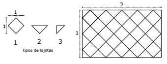

# Algoritmos e Programação
## Exercícios de Entrada e Saída

- [x] 1. Escreva um algoritmo que leia um número inteiro positivo e exiba o dobro do mesmo.

- [x] 2. Elabore um algoritmo que calcule a média aritmética de quatro números reais informados pelo usuário. A média deve ser impressa com 3 casas decimais.

- [x] 3. Escreva um algoritmo que leia duas variáveis inteiras e troque o conteúdo entre elas e imprima o novo valor das variáveis. Atenção: o conteúdo das variáveis TEM que ser trocado.

- [x] 4. Leia dois valores inteiros, no caso para variáveis A e B. A seguir, calcule a soma entre elas e atribua à variável SOMA. Imprima a mensagem "SOMA" com todas as letras maiúsculas, com um espaço em branco antes e depois da igualdade seguido pelo valor correspondente à soma de A e B. Exemplo de saída: SOMA = 3

- [x] 5. Faça um algoritmo para calcular e imprimir, com 2 casas decimais, o volume de uma esfera de raio R, em que R é um dado fornecido pelo usuário. O volume da esfera é calculado por (4/3)*Pi*R^3.

- [x] 6. Escreva um algoritmo que recebe as notas que um aluno tirou nas 3 unidades de uma disciplina e calcula a média de acordo com os critérios da UERN.

- [x] 7. Escreva um algoritmo que lê do teclado a medida do raio de uma circunferência e em seguida calcula e exibe o comprimento de uma circunferência.

- [x] 8. Escreva um algoritmo que recebe as notas que um aluno tirou nas 2 primeiras unidades de uma disciplina e calcula a nota que o aluno precisa tirar na 3ª unidade para passar por média. Use os critérios da UERN para cálculo da média.

- [x] 9. Escreva um algoritmo para calcular a área de um triângulo. O programa deve ler do teclado as medidas da base e da altura do triângulo.

- [x] 10. Faça um algoritmo capaz de inverter um número de 3 dígitos fornecido pelo usuário. A inversão consiste em apresentar primeiro a unidade, seguida da dezena e por último a centena.

- [x] 11. Desenvolva um algoritmo que leia um valor de hora (uma variável para a hora e outra para minuto) e informe quantos minutos se passaram desde o início do dia.

- [x] 12. Sabe-se que para iluminar de forma satisfatória um (1) metro quadrado de um ambiente são necessários 18W de potência. Desenvolva um algoritmo que leia a largura e a profundidade de uma sala e imprima a potência da lâmpada que deve ser usada.

- [x] 13. João tem um problema com os números. Ele sempre escreve números de quatro algarismos de trás para frente (o número 1234 ele escreve 4321). Escreva um algoritmo que imprima invertidos os números de quatro algarismos.

- [x] 14. Leia um valor inteiro, que é o tempo de duração em segundos de um determinado evento em uma fábrica, e imprima no formato horas:minutos:segundos. Por exemplo, para entrada 555 o programa deve imprimir 0:9:15

- [x] 15. Dois carros (X e Y) partem em uma mesma direção. O carro X sai com velocidade constante de 60 Km/h e o carro Y sai com velocidade constante de 90 Km/h. Em uma hora (60 minutos) o carro Y consegue se distanciar 30 quilômetros do carro X, ou seja, consegue se afastar um quilômetro a cada 2 minutos. - Leia a distância (em Km) e calcule quanto tempo leva (em minutos) para o carro Y tomar essa distância do outro carro.

- [x] 16. Faça um programa que leia dois números inteiros e imprima no formato de CEP. Exemplo

| Entrada:  | Saída:    |
| -------   | ------    |
| 59120     | 59120-086 |
| 86        |           |

- [x] 17. Faça um programa que leia quatro números inteiros e imprima no formato de um CPF. Exemplo:

| Entrada:  | Saída:        |
| -------   | ------        |
| 12        |012.345.678-09 |
| 345       |               |
| 678       |               |
| 9         |               |

### Piso da Escola

*OBI - Olimpíada Brasileira de Informática 2018 - Fase 1*

- [x] 18. O colégio pretende trocar o piso de uma sala de aula e a diretora aproveitou a oportunidade para passar uma tarefa aos alunos. A sala tem o formato de um retângulo de largura L metros e comprimento C metros, onde L e C são números inteiros. A diretora precisa comprar lajotas de cerâmica para cobrir todo o piso da sala. Seria fácil calcular quantas lajotas seriam necessárias se cada lajota fosse um quadrado de 1 metro de lado. O problema é que a lajota que a diretora quer comprar é um quadrado que possui 1 metro de diagonal, não de lado. Além disso, ela quer preencher o piso da sala com as diagonais das lajotas alinhadas aos lados da sala, como na figura.

A loja vai fornecer lajotas do tipo 1: inteiras; do tipo 2, que correspondem à metade das do tipo 1, cortadas ao longo da diagonal; e lajotas do tipo 3, que correspondem à metade do tipo 2. Veja os três tipos de lajotas na figura.

Está muito claro que sempre serão necessárias 4 lajotas do tipo 3 para os cantos da sala. A tarefa que a diretora passou para os alunos é calcular o número de lajotas dos tipos 1 e 2 que serão necessárias. Na figura, para L = 3 e C = 5, foram necessárias 23 do tipo 1 e 12 do tipo 2. Seu programa precisa computar, dados os valores de L e C, a quantidade de lajotas do tipo 1 e do tipo 2 necessárias.

**Entrada**

A primeira linha da entrada contém um inteiro L (1 ≤ L ≤ 100) indicando a largura da sala. A segunda linha contém um inteiro C (1 ≤ C ≤ 100)representando o comprimento da sala.

**Saída**

Imprima duas linhas na saída. A primeira deve conter um inteiro, representando o número de lajotas do tipo 1 necessárias. A segunda deve conter um inteiro, indicando o número de lajotas do tipo 2.

|Exemplos de Entrada|Exemplos de Saída  |
| -------           | ------            |
|   3               |   23              |
|   5               |   12              |

|                   |                   |
| ---               | ---               |
|   1               |   1               |
|   1               |   0               |

### Pedágio

*OBI - Olimpíada Brasileira de Informática 2010 Fase 1 Nível 1*

- [x] 19. A invenção do carro tornou muito mais rápido e mais barato realizar viagens de longa distância. Realizar uma viagem rodoviária tem dois tipos de custos: cada quilômetro percorrido na rodovia tem um custo associado (não só devido ao consumo de combustível mas também devido ao desgaste das peças do carro, pneus, etc.), mas também é necessário passar por vários pedágios localizados ao longo da rodovia.
Os pedágios são igualmente espaçados ao logo da rodovia; o começo da estrada não possui um pedágio, mas o seu final pode estar logo após um pedágio (por exemplo, se a distância entre dois pedágios consecutivos for de 37 km e a estrada tiver 111 km, o motorista deve pagar um pedágio aos 37 km, aos 74 km e aos 111 km, logo antes de terminar a sua viagem).
Dadas as características da rodovia e os custos com gasolina e com pedágios, calcule o custo total da viagem.

**Entrada**

A entrada consiste de duas linhas. A primeira linha da entrada contém dois inteiros L e D (1 ≤ L, D ≤ 104), indicando o comprimento da estrada e a distância entre pedágios, respectivamente. A segunda linha contém dois inteiros K e P (1 ≤ K, P ≤ 104 ), indicando o custo por quilômetro percorrido e o valor de cada pedágio. O primeiro pedágio está localizado no quilômetro D da estrada (ou seja, a distância do início da estrada para o primeiro pedágio é D quilômetros).

**Saída**

Seu programa deve imprimir uma única linha contendo um único inteiro, indicando o custo total da viagem.

|Exemplos de Entrada|Exemplos de Saída  |
| ---               | ---               |
|111 37             |141                |
|1 10               |                   |

|                   |                   |
| ---               | ---               |
|100 30             |342                |
|3 14               |                   |

|                   |                   |
| ---               | ---               |
|20 70              |180                |
|9 17               |                   |

:arrow_left: [voltar](../README.md)